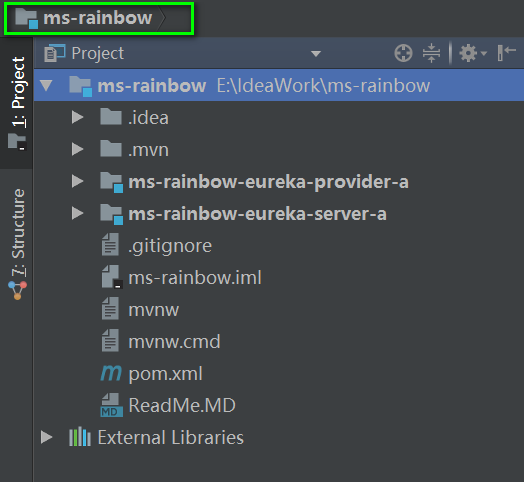

#### Spring Cloud 自学习

* 项目的结构
    

* 具体学习文档总结如下：
    
    [1.Spring Cloud Eureka Server 注册中心搭建](./ms-rainbow-eureka-server-a/doc/1.Spring%20Cloud%20Eureka%20Server%20搭建.md)
    
    [2.Spring Cloud Eureka Service Provider项目,向注册中心注册服务](./ms-rainbow-eureka-provider-a/doc/1.Spring%20Cloud%20Eureka%20Service%20Provider项目.md)

* 最新更新时间：2017-12-3（持续更新中...）
 