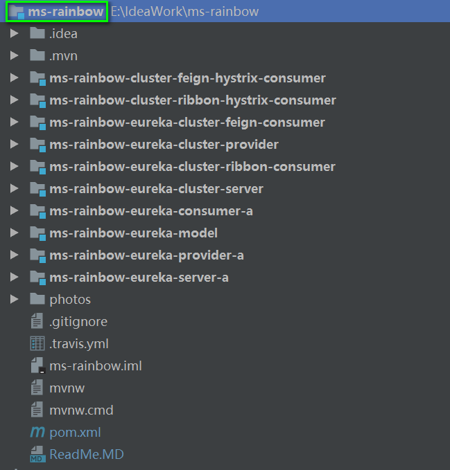

#### Spring Cloud 自学习
* 

* ms-rainbow微服务项目的结构如下图所示：
  

* 具体学习文档总结如下：
    
    [1.Spring Cloud Eureka Server 注册中心搭建](./ms-rainbow-eureka-server-a/doc/1.Spring%20Cloud%20Eureka%20Server%20搭建.md)
    
    [2.Spring Cloud Eureka Service Provider项目,向注册中心注册服务](./ms-rainbow-eureka-provider-a/doc/1.Spring%20Cloud%20Eureka%20Service%20Provider项目.md)
    
    [3.Spring Cloud Eureka Service Consumer项目,向注册中心获取服务](./ms-rainbow-eureka-consumer-a/doc/1.Spring-Cloud-Eureka-Service-Consumer项目.md)

    [4.Spring Cloud Eureka Cluster Server项目,搭建高可用的注册中心](./ms-rainbow-eureka-cluster-server/doc/1.Spring%20Cloud%20Eureka%20Cluster%20Server项目.md)
    
    [5.Spring Cloud Eureka Cluster Consumer Ribbon项目,实现客户端的负载均衡](./ms-rainbow-eureka-cluster-provider/doc/1.Spring%20Cloud%20Ribbon%20客户端负载均衡.md)
    
    [6.Spring Cloud Eureka Feign Consumer 项目，实现Feign优雅的调用远程服务](./ms-rainbow-eureka-cluster-feign-consumer/doc/1.Spring%20Cloud%20Eureka%20Feign%20Consumer%20项目.md)

    [7.Spring Cloud 中Ribbon&Hystrix使用方式](./ms-rainbow-cluster-ribbon-hystrix-consumer/doc/1.Spring%20Cloud%20中Ribbon&Hystrix使用方式.md)
    
    [8.Spring Cloud 中Feigh&Hystrix使用方式](./ms-rainbow-cluster-feign-hystrix-consumer/doc/1.Spring%20Cloud%20Feign&Hystrix项目.md)
    
* 最新更新时间：2017-12-16（持续更新中...）