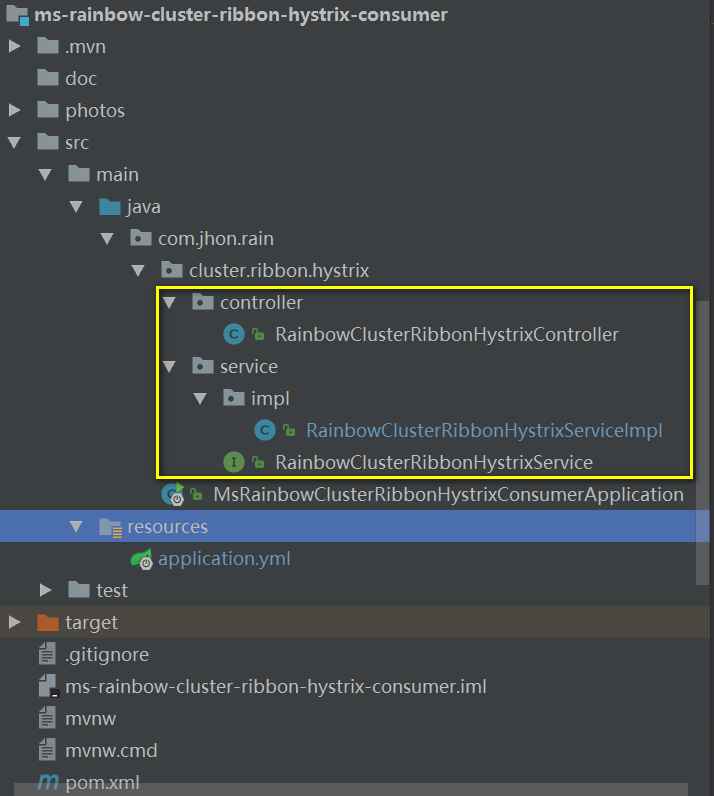
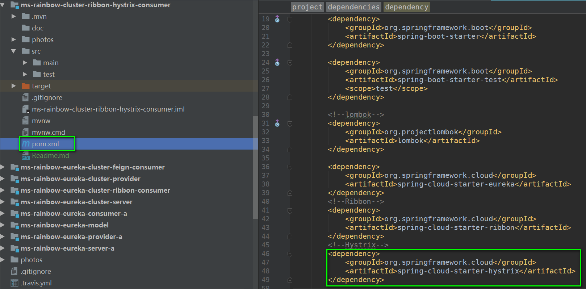
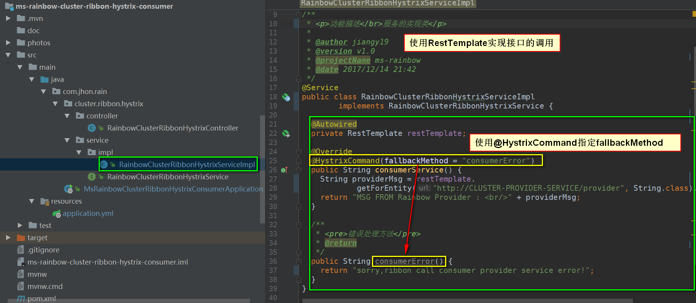
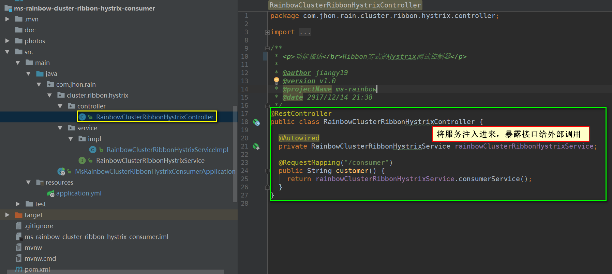
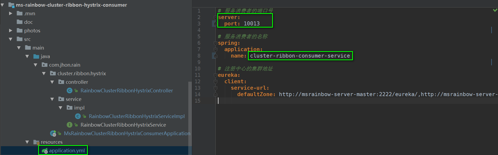
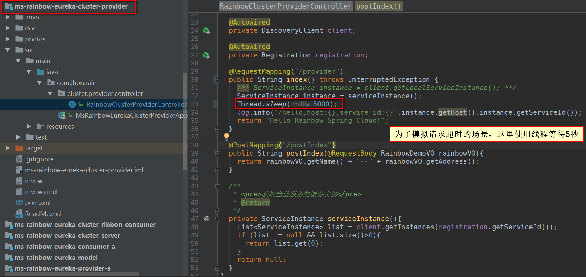
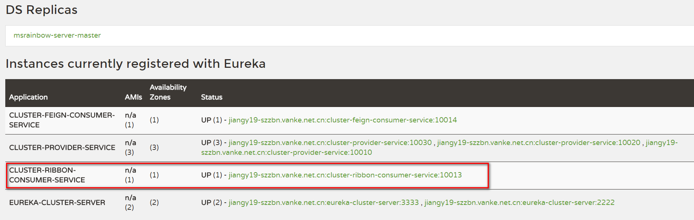
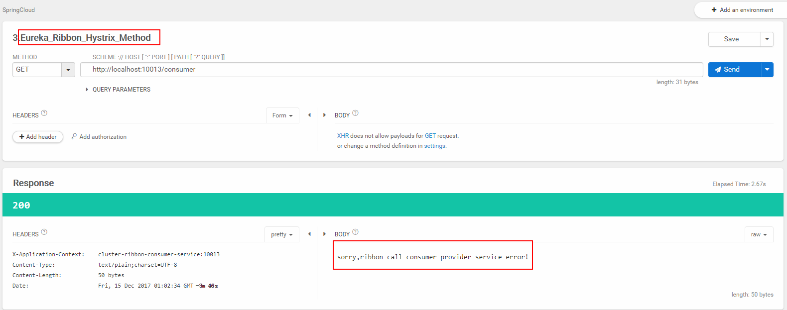

#### Spring Cloud -- Ribbon结合Hystrix 使用方式
* 在ms-rainbow-eureka-cluster-ribbon-consumer的基础上进行改造，新建一个Spring Boot项目，项目结构如下：

* 添加hystrix依赖

* 启动类中开启hystrix

* 创建接口层，将原来Controller的逻辑移入到Service实现类中，如下图所示，并且在方法上添加@Hystrixcommand注解，指定fallbackmethod,如下图所示：

* Controller中引入Service，实现接口的调用逻辑

* 修改配置文件，端口号+应用名称

* 为了模拟请求阻塞的场景，在服务提供者中，我们使用等待5秒的方式来模拟，如下图所示：

* 分别开启，eureka-servce[2节点集群]，eureka-provider[3节点集群]，eureka-ribbon-hystrix-consumer

* 使用Rest工具，访问消费者提供的接口，如下图所示：
