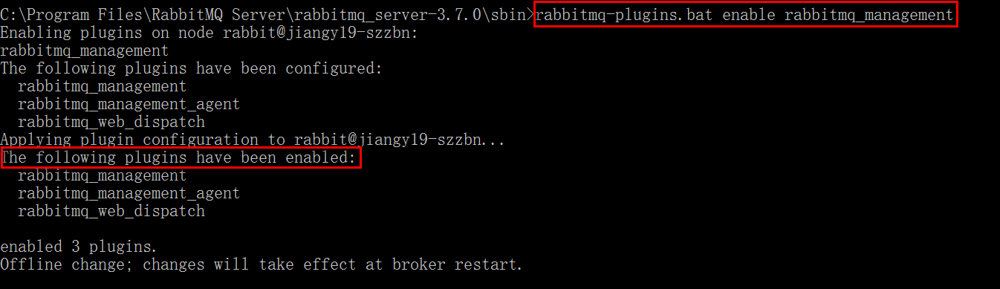

#### Spring Cloud Hystrix Dashboard Information aggravate

##### 一、安装RabbitMQ[这里不过多介绍]





##### 二、修改Ribbon-Consumer，使其支持Hystrix-Dashboard
* 添加监控依赖：actuator和hystrix-dashboard:
    
    
    ```xml
    <!--添加监控-->
    <dependency>
        <groupId>org.springframework.boot</groupId>
        <artifactId>spring-boot-starter-actuator</artifactId>
    </dependency>

    <dependency>
        <groupId>org.springframework.cloud</groupId>
        <artifactId>spring-cloud-starter-hystrix-dashboard</artifactId>
    </dependency>
    ```
* 修改Controller和Service，对外暴露两个Get请求接口，一个正常，一个超时：
    [Consumer-Controller]
    
    
    ```java
    package com.jhon.rain.cluster.ribbon.hystrix.controller;
    
    import com.jhon.rain.cluster.ribbon.hystrix.service.RainbowClusterRibbonHystrixService;
    import org.springframework.beans.factory.annotation.Autowired;
    import org.springframework.web.bind.annotation.RequestMapping;
    import org.springframework.web.bind.annotation.RestController;
    import org.springframework.web.client.RestTemplate;
    
    /**
     * <p>功能描述</br>Ribbon方式的Hystrix测试控制器</p>
     *
     * @author jiangy19
     * @version v1.0
     * @projectName ms-rainbow
     * @date 2017/12/14 21:38
     */
    @RestController
    public class RainbowClusterRibbonHystrixController {
    
      @Autowired
      private RainbowClusterRibbonHystrixService rainbowClusterRibbonHystrixService;
    
      @RequestMapping("/errorConsumer")
      public String errorCustomer() {
        return rainbowClusterRibbonHystrixService.notNormalConsumerService();
      }
    
      @RequestMapping("/normalConsumer")
      public String normalCustomer() {
        return rainbowClusterRibbonHystrixService.normalConsumerService();
      }
    }

    ```
    [Consumer-Service]
    
    
    ```java
    package com.jhon.rain.cluster.ribbon.hystrix.service.impl;
    
    import com.jhon.rain.cluster.ribbon.hystrix.service.RainbowClusterRibbonHystrixService;
    import com.netflix.hystrix.contrib.javanica.annotation.HystrixCommand;
    import org.springframework.beans.factory.annotation.Autowired;
    import org.springframework.stereotype.Service;
    import org.springframework.web.client.RestTemplate;
    
    /**
     * <p>功能描述</br>服务的实现类</p>
     *
     * @author jiangy19
     * @version v1.0
     * @projectName ms-rainbow
     * @date 2017/12/14 21:42
     */
    @Service
    public class RainbowClusterRibbonHystrixServiceImpl
            implements RainbowClusterRibbonHystrixService {
    
      @Autowired
      private RestTemplate restTemplate;
    
      @Override
      @HystrixCommand(fallbackMethod = "consumerError")
      public String notNormalConsumerService() {
        String providerMsg = restTemplate.
                getForEntity("http://CLUSTER-PROVIDER-SERVICE/provider", String.class).getBody();
        return "MSG FROM Rainbow Provider : <br/>" + providerMsg;
      }
    
      @Override
      @HystrixCommand(fallbackMethod = "consumerError")
      public String normalConsumerService() {
        String providerMsg = restTemplate.
                getForEntity("http://CLUSTER-PROVIDER-SERVICE/normalProvider", String.class).getBody();
        return "MSG FROM Rainbow Provider : <br/>" + providerMsg;
      }
    
      /**
       * <pre>错误处理方法</pre>
       * @return
       */
      public String consumerError() {
        return "sorry,ribbon call consumer provider service error!";
      }
    }

    ```
* 主类开启Dashboard注解
    
    
    ```java
    package com.jhon.rain;
    
    import org.springframework.boot.SpringApplication;
    import org.springframework.boot.autoconfigure.SpringBootApplication;
    import org.springframework.cloud.client.circuitbreaker.EnableCircuitBreaker;
    import org.springframework.cloud.client.discovery.EnableDiscoveryClient;
    import org.springframework.cloud.client.loadbalancer.LoadBalanced;
    import org.springframework.cloud.netflix.hystrix.EnableHystrix;
    import org.springframework.cloud.netflix.hystrix.dashboard.EnableHystrixDashboard;
    import org.springframework.context.annotation.Bean;
    import org.springframework.web.client.RestTemplate;
    
    @EnableHystrix
    @EnableHystrixDashboard
    @EnableCircuitBreaker
    @EnableDiscoveryClient
    @SpringBootApplication
    public class MsRainbowClusterRibbonHystrixConsumerApplication {
    
    	@Bean
    	@LoadBalanced
    	RestTemplate restTemplate() {
    		return new RestTemplate();
    	}
    
    	public static void main(String[] args) {
    		SpringApplication
    						.run(MsRainbowClusterRibbonHystrixConsumerApplication.class,
    										args);
    	}
    }

    ```


##### 三、Provider 项目改造,提供给消费者两个接口，一个模拟接口超时，一个模拟接口正常，如下图所示：


```java
package com.jhon.rain.cluster.provider.controller;

import com.jhon.rain.model.RainbowDemoVO;
import lombok.extern.slf4j.Slf4j;
import org.springframework.beans.factory.annotation.Autowired;
import org.springframework.cloud.client.ServiceInstance;
import org.springframework.cloud.client.discovery.DiscoveryClient;
import org.springframework.cloud.client.serviceregistry.Registration;
import org.springframework.web.bind.annotation.PostMapping;
import org.springframework.web.bind.annotation.RequestBody;
import org.springframework.web.bind.annotation.RequestMapping;
import org.springframework.web.bind.annotation.RestController;

import java.util.List;

/**
 * Created by jiangy19 on 2017/12/12.
 */
@RestController
@Slf4j
public class RainbowClusterProviderController {

  @Autowired
  private DiscoveryClient client;

  @Autowired
  private Registration registration;

  @RequestMapping("/provider")
  public String index() throws InterruptedException {
    /** ServiceInstance instance = client.getLocalServiceInstance(); **/
    ServiceInstance instance = serviceInstance();
    Thread.sleep(5000);
    log.info("/hello,host:{},service_id:{}",instance.getHost(),instance.getServiceId());
    return "Hello Rainbow Spring Cloud!";
  }

  @RequestMapping("/normalProvider")
  public String index2() throws InterruptedException {
    /** ServiceInstance instance = client.getLocalServiceInstance(); **/
    ServiceInstance instance = serviceInstance();
    log.info("/hello,host:{},service_id:{}",instance.getHost(),instance.getServiceId());
    return "Hello Rainbow Spring Cloud 2!";
  }

  @PostMapping("/postIndex")
  public String postIndex(@RequestBody RainbowDemoVO rainbowVO){
    return rainbowVO.getName() + "--" + rainbowVO.getAddress();
  }

  /**
   * <pre>获取当前服务的服务实例</pre>
   * @return
   */
  private ServiceInstance serviceInstance(){
    List<ServiceInstance> list = client.getInstances(registration.getServiceId());
    if (list != null && list.size()>0){
      return list.get(0);
    }
    return null;
  }
}

```

##### 四、Turbine项目
* 这里要注意配置文件Turbine的配置
    
    
    ```yml
    # 应用的名称
    spring:
      application:
        name: cluster-ribbon-hystrix-turbine
    # 端口号
    server:
      port: 20016
    
    # 注册中心的集群地址
    eureka:
      client:
        service-url:
          defaultZone: http://msrainbow-server-master:2222/eureka/,http://msrainbow-server-slave-one:3333/eureka/
    
    # trubine的配置
    turbine:
      app-config: cluster-ribbon-consumer-service
      # 如果不配置这里，则监控的url需要为：host:port/turbine.stream?cluster=CUSTOMERS
      cluster-name-expression: new String("default")
      combine-host-port: true
    
    management:
      port: 20017

    ```
* 开启Turbine注解
    
    
    ```java
    package com.jhon.rain;
    
    import org.springframework.boot.SpringApplication;
    import org.springframework.boot.autoconfigure.EnableAutoConfiguration;
    import org.springframework.boot.autoconfigure.SpringBootApplication;
    import org.springframework.cloud.client.discovery.EnableDiscoveryClient;
    import org.springframework.cloud.netflix.turbine.EnableTurbine;
    import org.springframework.context.annotation.Configuration;
    
    @Configuration
    @EnableAutoConfiguration
    @EnableTurbine
    @EnableDiscoveryClient
    public class MsRainbowClusterRibbonHystrixTurbineApplication {
    
    	public static void main(String[] args) {
    		SpringApplication.run(MsRainbowClusterRibbonHystrixTurbineApplication.class, args);
    	}
    }

    ```
##### 五、依次启动各个项目
 * EurekaServer[2个节点]
 * EurekaClusterProvider[3节点]
 * EurekaClusterRibbonHystrixConsumer[1节点]
 * EurekaClusterRibbonHystrixTurbine[1节点]
 * 具体如下图所示：
    


##### 六、浏览器查看注册中心，如下图所示，总共UP 7 个节点


##### 七、模拟客户端接口调用
* 正常接口：

* 超时接口：


##### 八、访问Dashboard界面并且查看结果：


