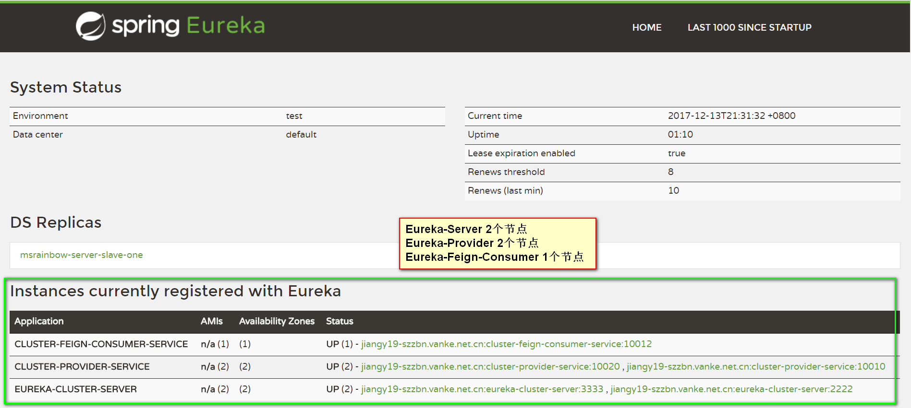
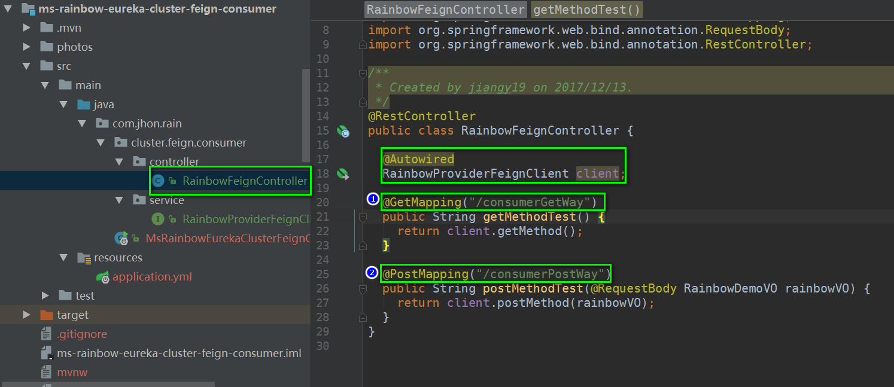
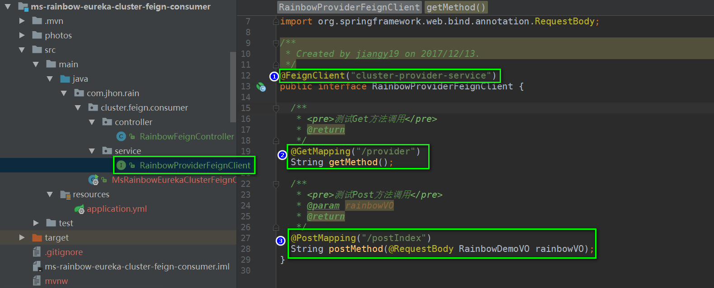
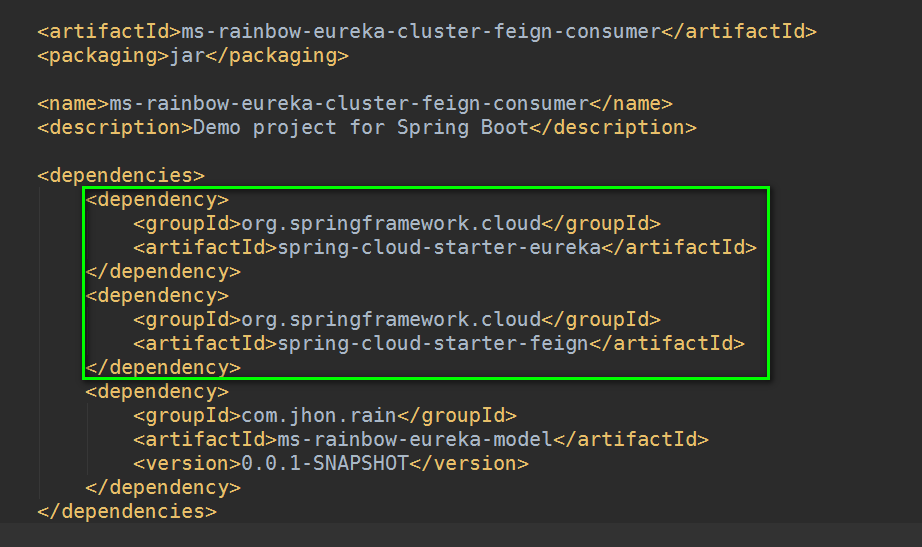
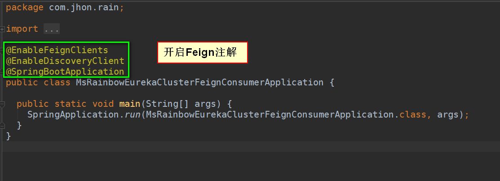
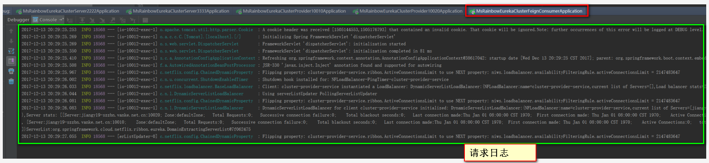
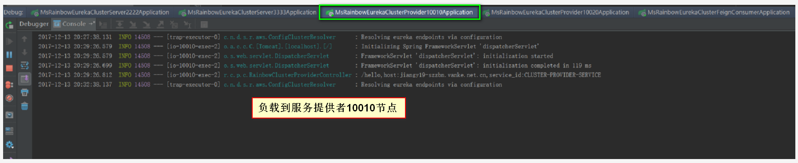
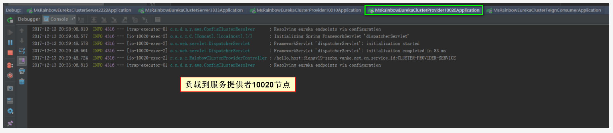
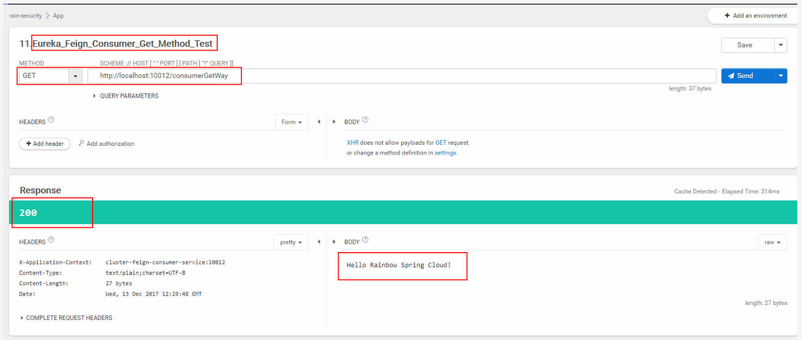
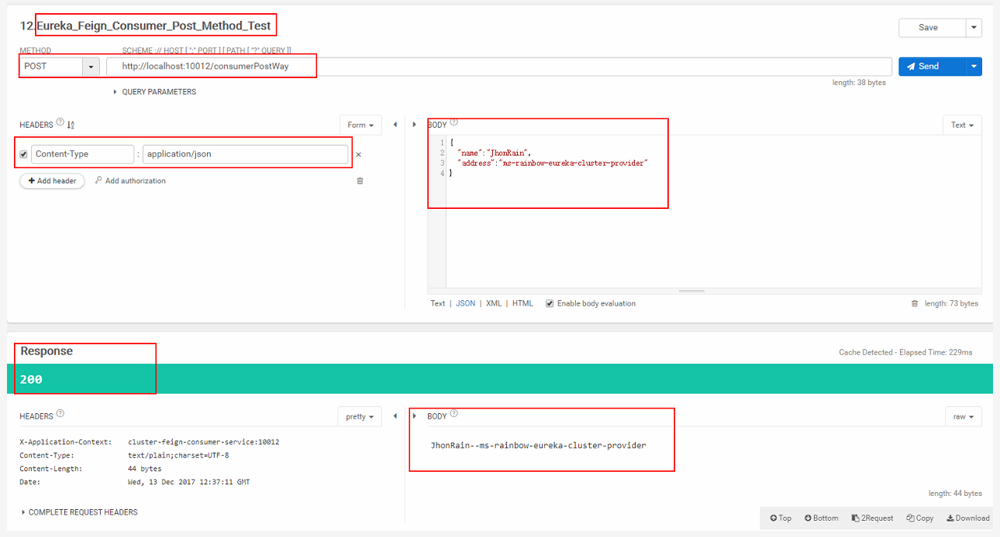

#### Spring Cloud Eureka Feign Consumer 项目
* Spring Cloud Feign介绍


* 启动项目，访问注册中心，如下图所示，包含5个服务
    
* 控制器
    
    ```java
    package com.jhon.rain.cluster.feign.consumer.controller;
    
    import com.jhon.rain.cluster.feign.consumer.service.RainbowProviderFeignClient;
    import com.jhon.rain.model.RainbowDemoVO;
    import org.springframework.beans.factory.annotation.Autowired;
    import org.springframework.web.bind.annotation.GetMapping;
    import org.springframework.web.bind.annotation.PostMapping;
    import org.springframework.web.bind.annotation.RequestBody;
    import org.springframework.web.bind.annotation.RestController;
    
    /**
     * <p>功能描述</br> 控制器 </p>
     *
     * @projectName ms-rainbow
     * @author jiangy19
     * @date 2017/12/13 21:48
     * @version v1.0
     */
    @RestController
    public class RainbowFeignController {
    
      @Autowired
      RainbowProviderFeignClient client;
    
      @GetMapping("/consumerGetWay")
      public String getMethodTest() {
        return client.getMethod();
      }
    
      @PostMapping("/consumerPostWay")
      public String postMethodTest(@RequestBody RainbowDemoVO rainbowVO) {
        return client.postMethod(rainbowVO);
      }
    }
    ```
* Feign Client Service(创建一个Feign的客户端接口定义。使用@FeignClient注解来指定这个接口所要调用的服务名称)
    
    ```java
    package com.jhon.rain.cluster.feign.consumer.service;
    
    import com.jhon.rain.model.RainbowDemoVO;
    import org.springframework.cloud.netflix.feign.FeignClient;
    import org.springframework.web.bind.annotation.GetMapping;
    import org.springframework.web.bind.annotation.PostMapping;
    import org.springframework.web.bind.annotation.RequestBody;
    
    /**
     * <p>功能描述</br> Feign接口申明 </p>
     *
     * @projectName ms-rainbow
     * @author jiangy19
     * @date 2017/12/13 21:50
     * @version v1.0
     */
    @FeignClient("cluster-provider-service")
    public interface RainbowProviderFeignClient {
    
      /**
       * <pre>测试Get方法调用</pre>
       * @return
       */
      @GetMapping("/provider")
      String getMethod();
    
      /**
       * <pre>测试Post方法调用</pre>
       * @param rainbowVO
       * @return
       */
      @PostMapping("/postIndex")
      String postMethod(@RequestBody RainbowDemoVO rainbowVO);
    }
    ```
* 项目的主要依赖
    
    ```xml
    <dependency>
        <groupId>org.springframework.cloud</groupId>
        <artifactId>spring-cloud-starter-eureka</artifactId>
    </dependency>
    <dependency>
        <groupId>org.springframework.cloud</groupId>
        <artifactId>spring-cloud-starter-feign</artifactId>
    </dependency>
    ```
* 应用程序主类(添加@EnableFeignClients注解开启扫描Spring Cloud Feign客户端的功能)
    
    ```java
    package com.jhon.rain;
    
    import org.springframework.boot.SpringApplication;
    import org.springframework.boot.autoconfigure.SpringBootApplication;
    import org.springframework.cloud.client.discovery.EnableDiscoveryClient;
    import org.springframework.cloud.netflix.feign.EnableFeignClients;
    
    /**
     * <p>功能描述</br> 主应用程序 </p>
     *
     * @projectName ms-rainbow
     * @author jiangy19
     * @date 2017/12/13 21:50
     * @version v1.0
     */
    
    @EnableFeignClients
    @EnableDiscoveryClient
    @SpringBootApplication
    public class MsRainbowEurekaClusterFeignConsumerApplication {
    
        public static void main(String[] args) {
            SpringApplication.run(MsRainbowEurekaClusterFeignConsumerApplication.class, args);
        }
    }
    ```
    
* 使用客户端访问，访问日志如下：
    

* 由于Feign是基于Ribbon实现的，所以它自带了客户端负载均衡功能，也可以通过Ribbon的IRule进行策略扩展，所以使用客户端访问两次，分别负载到两个服务提供者上去了，结果如下图所示：
    

    

* 客户端模拟Get和Post请求，请求结果如下图所示：
    

    
    
* 结束语
> Spring Cloud Feign是一套基于Netflix Feign实现的声明式服务调用客户端。它使得编写Web服务客户端变得更加简单