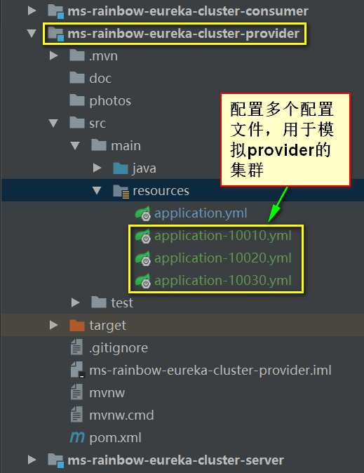
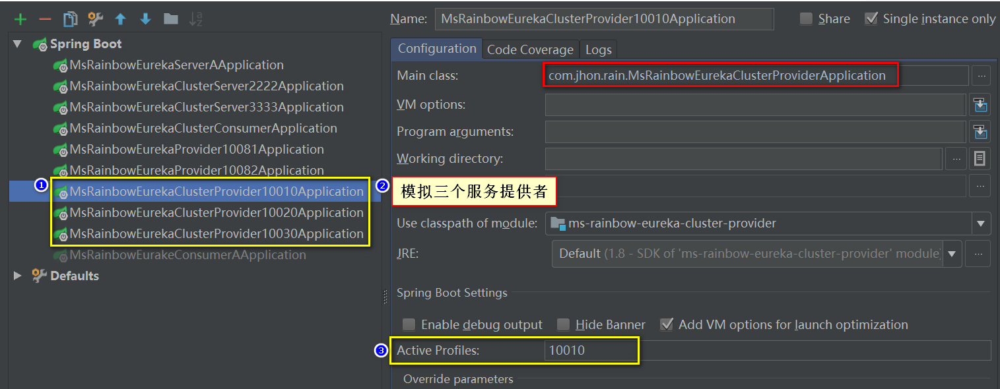
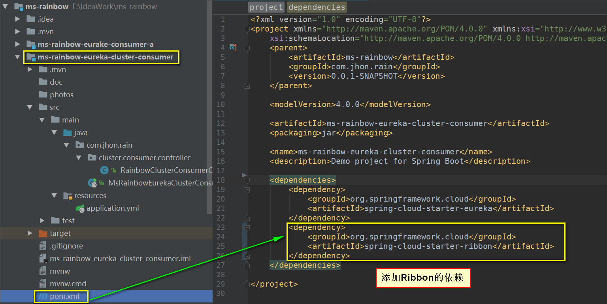
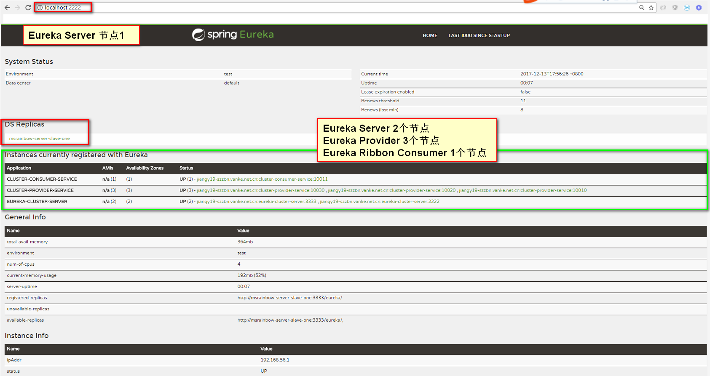
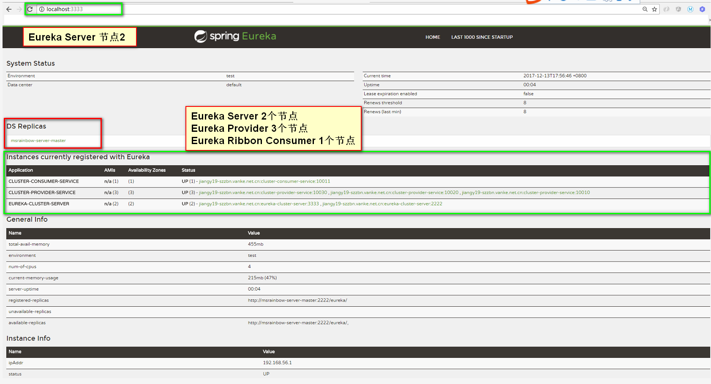
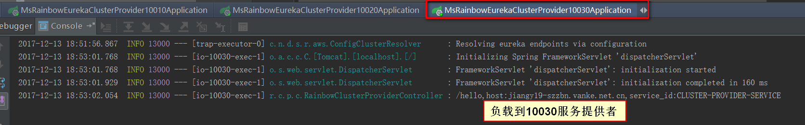
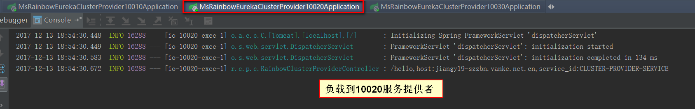
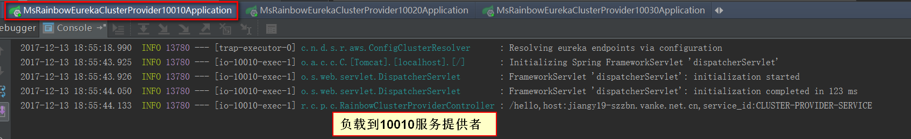

#### Spring Cloud Ribbon 客户端负载均衡
> Spring Cloud Ribbon有一个拦截器，它能够在这里进行实际调用的时候，自动的去选取服务实例，并将实际要请求的IP地址和端口替换这里的服务名，从而完成服务接口的调用.

* 1.修改ms-rainbow-eureka-cluster-provider项目，增加三个配置文件，用于模拟开启三个服务提供者，如下图所示：
    

* 2.使用Idea 配置三个启动类（针对不同的profile进行启动：三个不同的端口号）
    


* 3.修改ms-rainbow-eureka-cluster-consumer项目，增加Ribbon的依赖
    ```xml
    <dependency>
        <groupId>org.springframework.cloud</groupId>
        <artifactId>spring-cloud-starter-ribbon</artifactId>
    </dependency>
    ```
    

* 4.ms-rainbow-eureka-cluster-consumer项目要实现客户端的负载均衡，需要注入RestTemplate和加上@LoadBalance注解，如下图所示：
    
    
* 5.依次启动项目
    * 5.1 MsRainbowEurekaClusterServer2222Application
    * 5.2 MsRainbowEurekaClusterServer3333Application
    * 5.3 MsRainbowEurekaClusterProvider10010Application
    * 5.4 MsRainbowEurekaClusterProvider10020Application
    * 5.5 MsRainbowEurekaClusterProvider10030Application
    * 5.6 MsRainbowEurekaClusterConsumerApplication
    
* 6.查看效果
    * 6.1 Eureka注册中心
    
    
    * 6.2 Eureka Consumer Ribbon效果测试(分别进行三次访问：http://localhost:10011/consumer)
    
    
    
    
    