#### Spring Cloud Eureka Cluster 搭建
* 修改Hosts文件，添加如下映射（这个可以自定义），如下图所示：
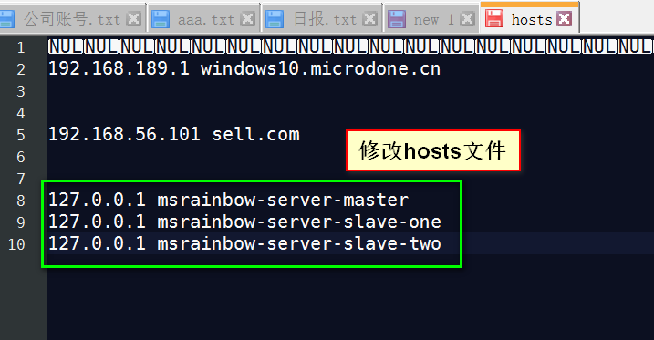

* 新建三个SpringBoot项目，项目结构如下：
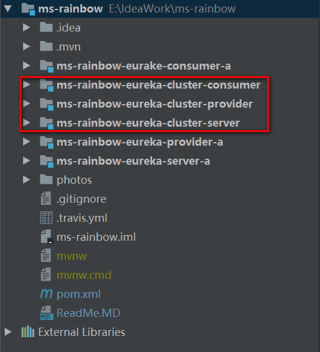

* 修改父POM文件，添加模块的依赖，配置如下图所示：
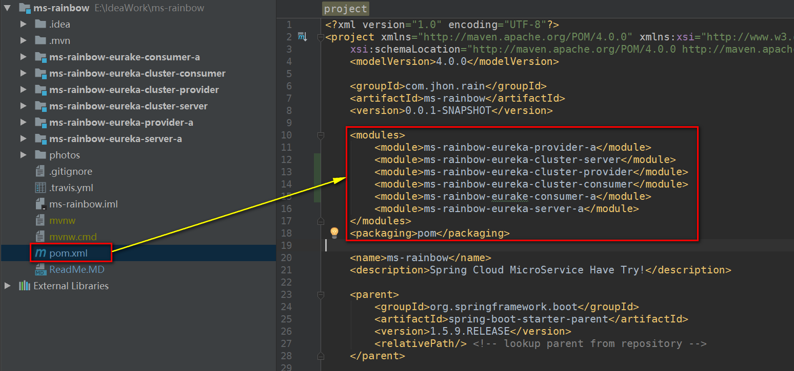

* 注册中心配置（高可用方式，这里为了模拟就开启两个应用程序）

    * 为了模拟集群的注册中心，这里使用两个不同的配置文件来进行，如下图所示：
    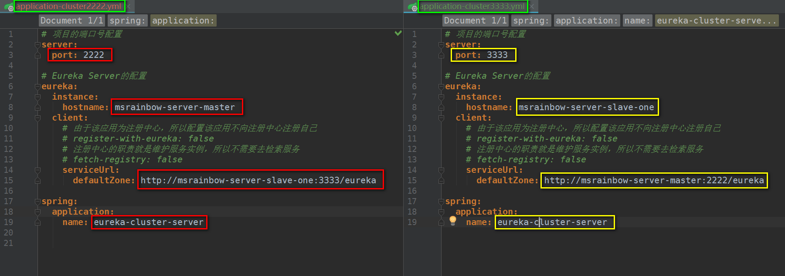
    * 使用Idea配置不同的启动程序加载不同的profile,如下图所示：
    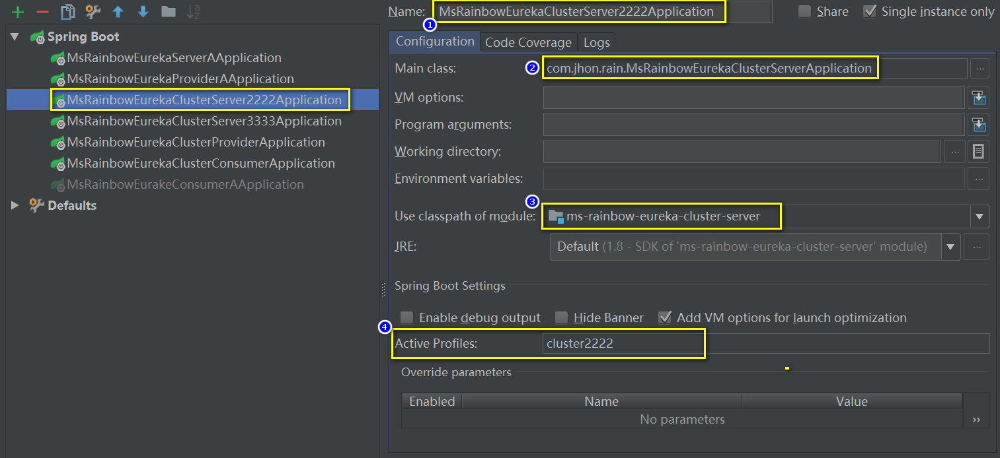
    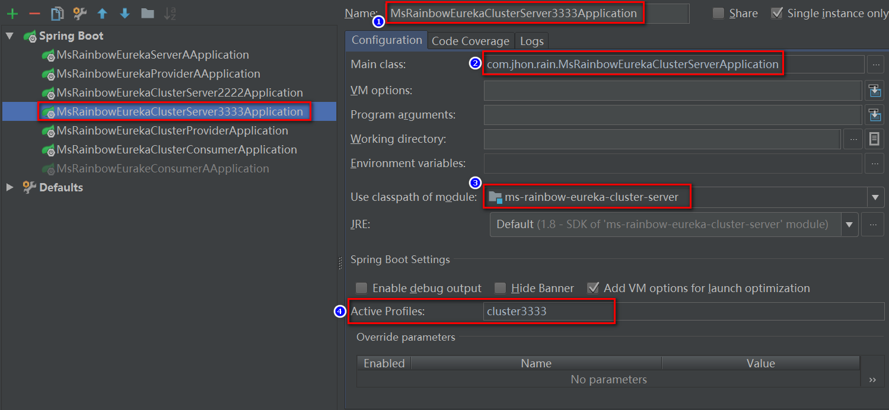

* 启动上面的注册中心和服务提供者、服务消费者四个节点，查看注册中心界面，如下图所示：
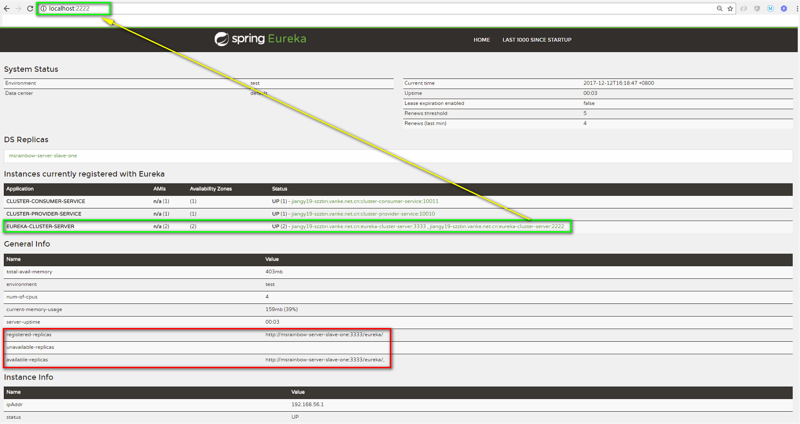
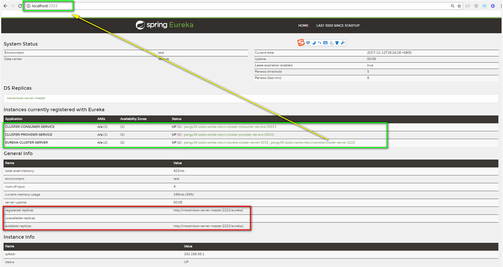

* 服务提供者配置文件配置
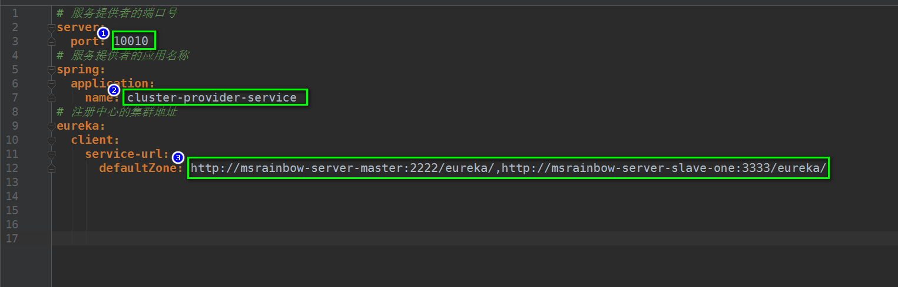

* 服务消费者配置文件配置
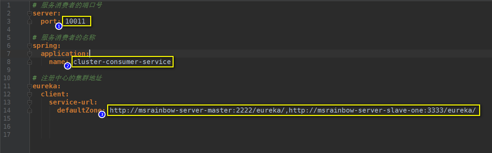

* 直接访问服务提供者的接口
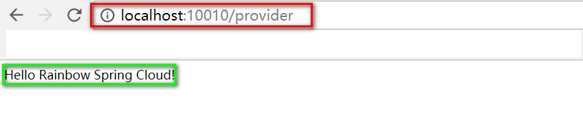

* 直接访问服务消费者的接口
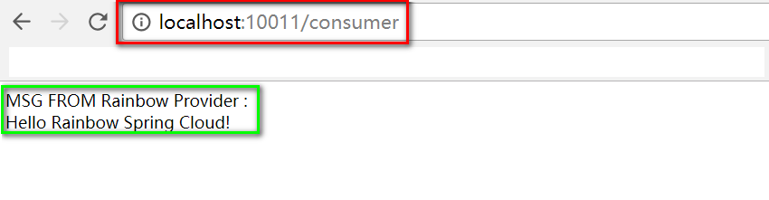

##### 结束语
　　　到此为止，Eureka(服务治理组件：包含三部分--服务注册中心、服务注册、服务发现)作为注册中心的高可用的方式就模拟结束了，下一阶段将开启：Spring Ribbon(客户端负载均衡)/Zuul(网关组件)/Feign(服务调用组件)/Hystrix(容错管理组件)的学习，敬请期待。。。