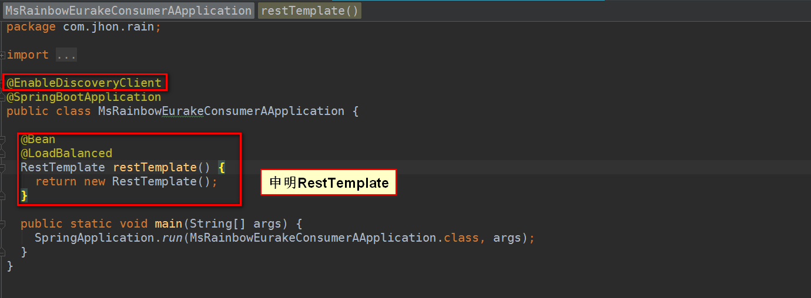
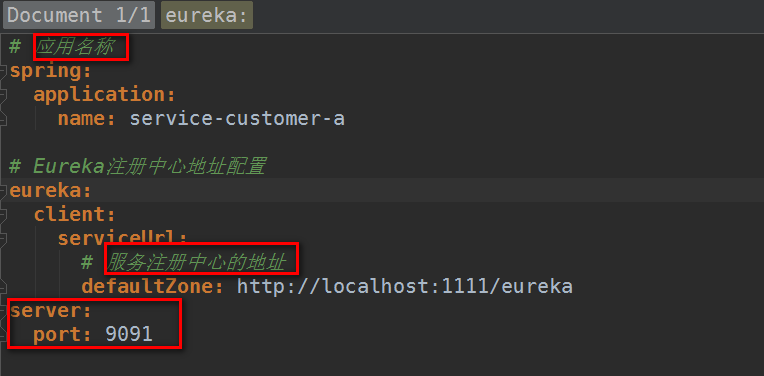
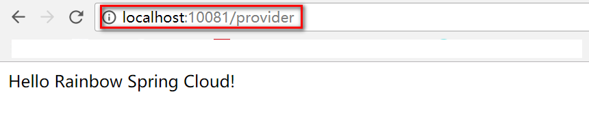
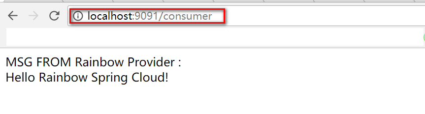

#### Spring Cloud Eureka Service Consumer 项目

##### 一、创建一个Spring Boot项目作为服务消费者
> 因为项目采用了多模块化的Maven项目，所以基础的依赖都配置到了父POM文件中，子模块根据自己的需要进行其它依赖的引用。

* 父模块的依赖配置
    ```xml
    <dependencies>
        <dependency>
            <groupId>org.springframework.boot</groupId>
            <artifactId>spring-boot-starter</artifactId>
        </dependency>

        <dependency>
            <groupId>org.springframework.boot</groupId>
            <artifactId>spring-boot-starter-test</artifactId>
            <scope>test</scope>
        </dependency>
    </dependencies>

    <dependencyManagement>
        <dependencies>
            <dependency>
                <groupId>org.springframework.cloud</groupId>
                <artifactId>spring-cloud-dependencies</artifactId>
                <version>${spring-cloud.version}</version>
                <type>pom</type>
                <scope>import</scope>
            </dependency>
        </dependencies>
    </dependencyManagement>

    <build>
        <plugins>
            <plugin>
                <groupId>org.springframework.boot</groupId>
                <artifactId>spring-boot-maven-plugin</artifactId>
            </plugin>
        </plugins>
    </build>
    ```
* Consumer的依赖配置
    ```xml
    <dependencies>
        <dependency>
            <groupId>org.springframework.cloud</groupId>
            <artifactId>spring-cloud-starter-eureka</artifactId>
        </dependency>
    </dependencies>
    ```
    
##### 二、配置主程序，启用客户端发现

```java
package com.jhon.rain;

import org.springframework.boot.SpringApplication;
import org.springframework.boot.autoconfigure.SpringBootApplication;
import org.springframework.cloud.client.discovery.EnableDiscoveryClient;
import org.springframework.cloud.client.loadbalancer.LoadBalanced;
import org.springframework.context.annotation.Bean;
import org.springframework.web.client.RestTemplate;

@EnableDiscoveryClient
@SpringBootApplication
public class MsRainbowEurakeConsumerAApplication {

	@Bean
	@LoadBalanced
	RestTemplate restTemplate() {
		return new RestTemplate();
	}

	public static void main(String[] args) {
		SpringApplication.run(MsRainbowEurakeConsumerAApplication.class, args);
	}
}
```

##### 三、编写一个自定义的RestController类，调用Provider提供的接口

```java
package com.jhon.rain.consumer.a.controller;

import org.springframework.beans.factory.annotation.Autowired;
import org.springframework.web.bind.annotation.RequestMapping;
import org.springframework.web.bind.annotation.RestController;
import org.springframework.web.client.RestTemplate;

/**
 * Created by jiangy19 on 2017/12/12.
 */
@RestController
public class RainbowConsumerController {
  @Autowired
  private RestTemplate restTemplate;

  @RequestMapping("/consumer")
  public String customer() {
    String providerMsg = restTemplate.getForEntity("http://SERVICE-PROVIDER-A/provider", String.class).getBody();

    return "MSG FROM Rainbow Provider : <br/>" + providerMsg;
  }
}

```

##### 四、配置文件

```xml
# 应用名称
spring:
  application:
    name: service-customer-a

# Eureka注册中心地址配置
eureka:
  client:
    serviceUrl:
      # 服务注册中心的地址
      defaultZone: http://localhost:1111/eureka
      
# 项目端口号
server:
  port: 9091

```

##### 五、查看效果
* 注册中心

* 调用服务提供者

* 调用服务消费者



##### 六、结束语
　　至此，Spring-Cloud-Eurake的三部分都完成了，包括注册中心、服务提供者、服务消费者。当然，这里只是做一个简单的演示，而且没有考虑到实际应用场景中的高可用，在接下来，我将会模拟注册中心集群的方式来同样的搭建一套类似的服务，敬请期待。。。
