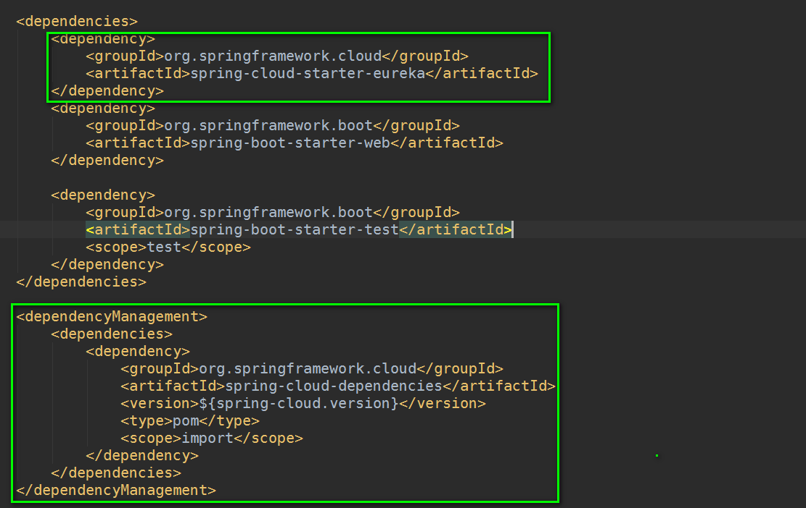
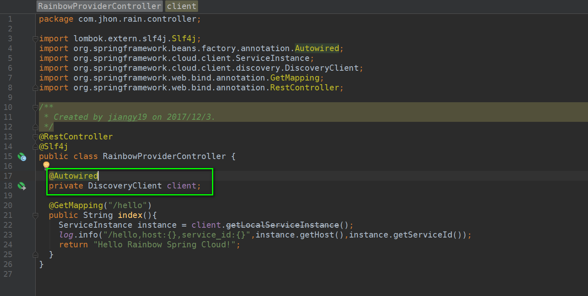
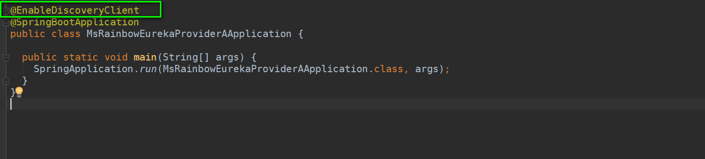
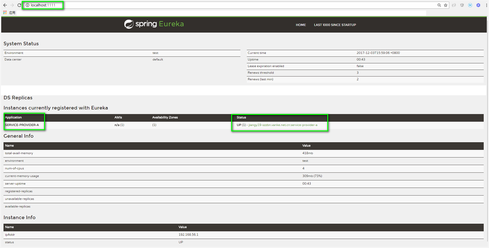
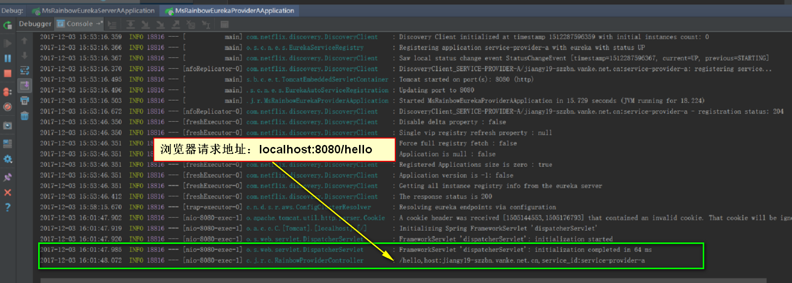

#### Spring Cloud Eureka Service Provider项目

##### 一、创建一个Spring Boot项目作为微服务,添加如下依赖



```xml
<dependencies>
    <dependency>
        <groupId>org.springframework.cloud</groupId>
        <artifactId>spring-cloud-starter-eureka</artifactId>
    </dependency>
    <dependency>
        <groupId>org.springframework.boot</groupId>
        <artifactId>spring-boot-starter-web</artifactId>
    </dependency>
    
    <dependency>
        <groupId>org.springframework.boot</groupId>
        <artifactId>spring-boot-starter-test</artifactId>
        <scope>test</scope>
    </dependency>
</dependencies>

<dependencyManagement>
<dependencies>
    <dependency>
        <groupId>org.springframework.cloud</groupId>
        <artifactId>spring-cloud-dependencies</artifactId>
        <version>${spring-cloud.version}</version>
        <type>pom</type>
        <scope>import</scope>
    </dependency>
</dependencies>
</dependencyManagement>

```

##### 二、创建一个Restful API 接口

```java
package com.jhon.rain.controller;

import lombok.extern.slf4j.Slf4j;
import org.springframework.beans.factory.annotation.Autowired;
import org.springframework.cloud.client.ServiceInstance;
import org.springframework.cloud.client.discovery.DiscoveryClient;
import org.springframework.web.bind.annotation.GetMapping;
import org.springframework.web.bind.annotation.RestController;

/**
 * Created by jiangy19 on 2017/12/3.
 */
@RestController
@Slf4j
public class RainbowProviderController {

  @Autowired
  private DiscoveryClient client;

  @GetMapping("/hello")
  public String index(){
    ServiceInstance instance = client.getLocalServiceInstance();
    log.info("/hello,host:{},service_id:{}",instance.getHost(),instance.getServiceId());
    return "Hello Rainbow Spring Cloud!";
  }
}

```

##### 三、主类中开启@EnableDiscoveryClient注解




##### 四、运行服务提供项目，向注册中心注册服务
* 启动服务提供者项目后，注册中心的日志：


* 启动服务提供者项目后，当前应用的日志：


* 再去注册中心查看，发现有一个SERVICE-PROVIDER-A应用注册成功了


* 浏览器访问localhost:8080/hello接口，查看服务提供者中的日志信息：


##### 五、结束语
　　到此，结合前面的注册中心，我们本节实现了，服务的注册！由于现在的注册中心是单体的，这样就会存在风险，因为在微服务架构的分布式环境中，需要充分
考虑到发生故障的情况，所以在实际项目中，必须对各个组件进行高可用的部署。所以，对于我们这里搭建的注册中心，使用单节点是不符合要求的，下一节，
就带领大家一步一步的实现注册中心的高可用部署，敬请期待。