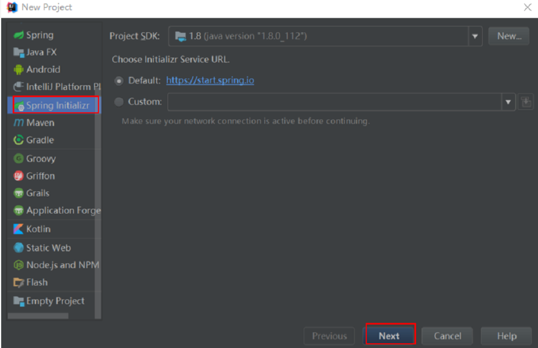
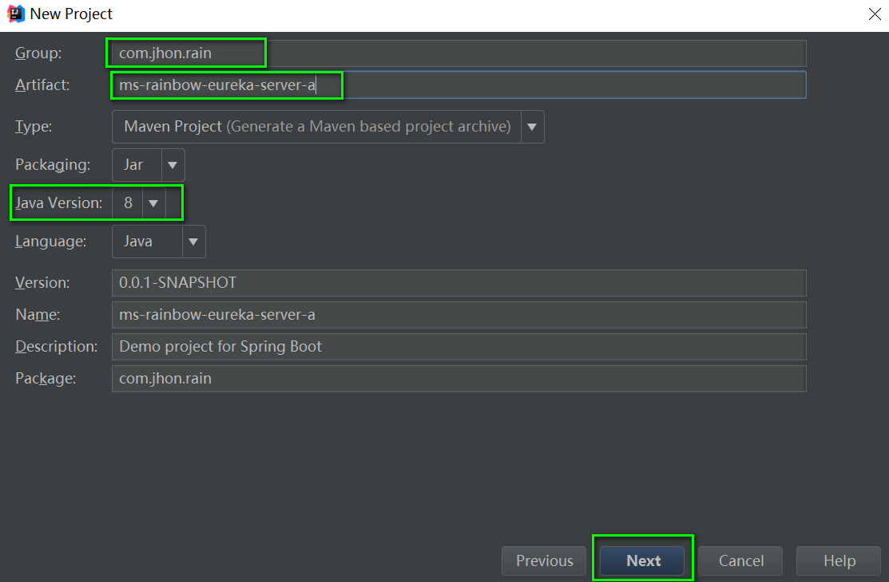
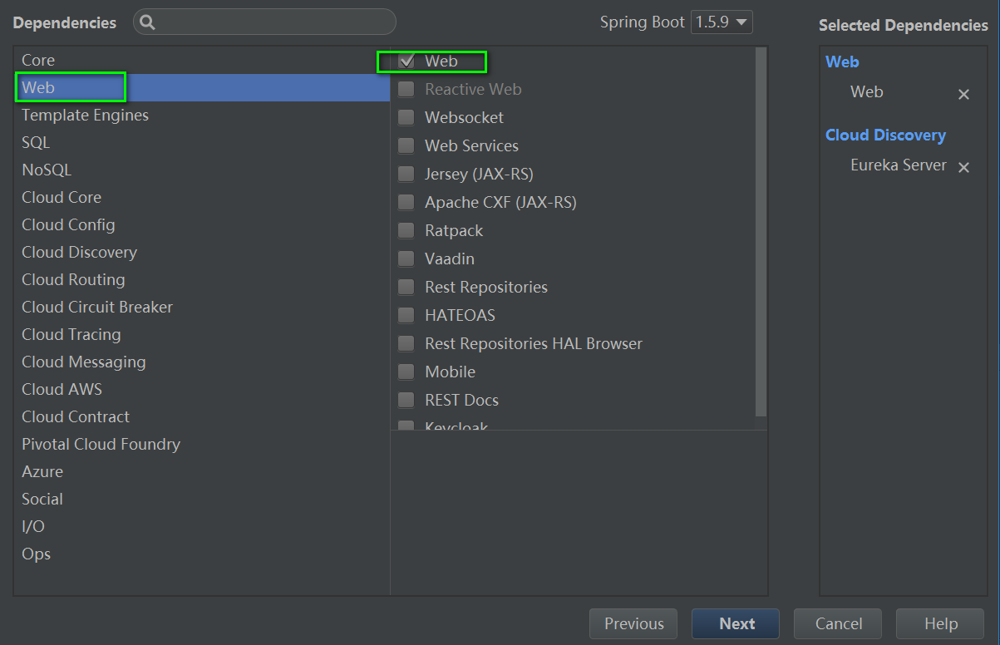
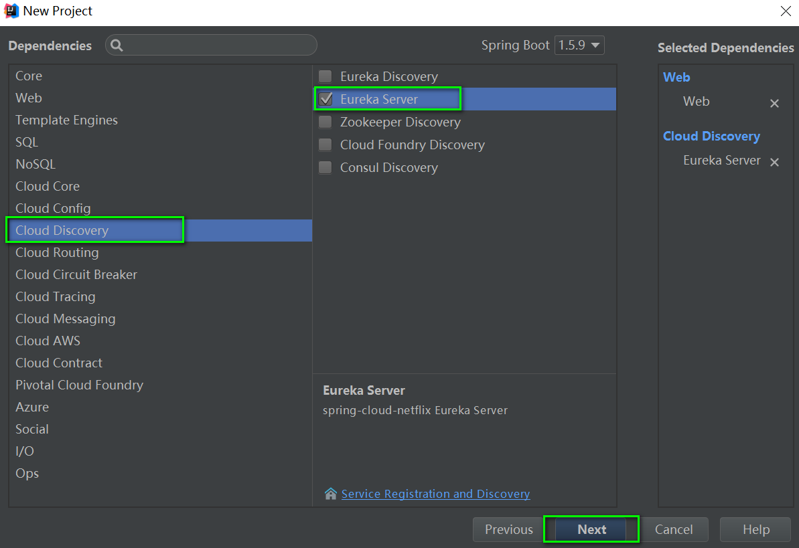
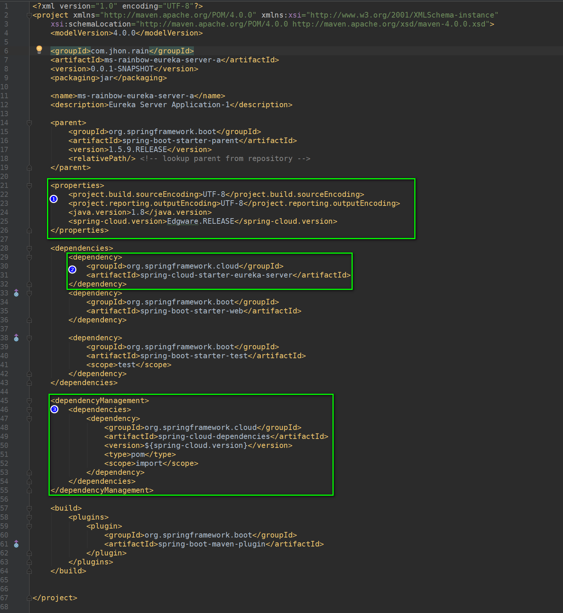
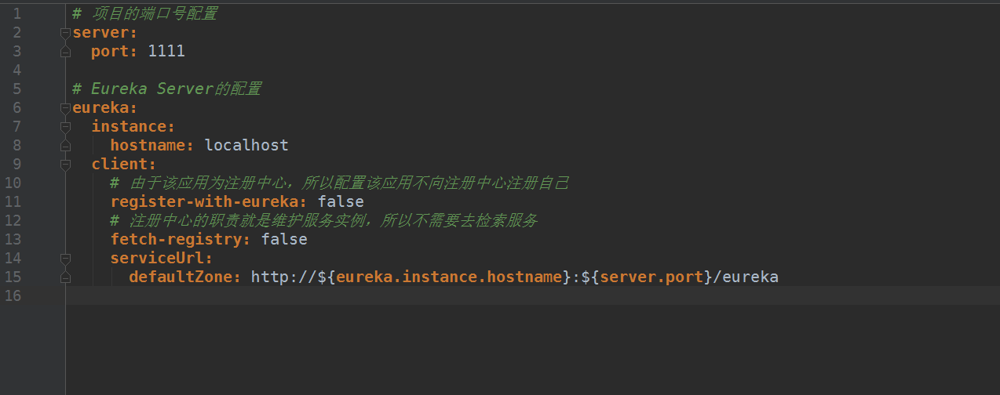
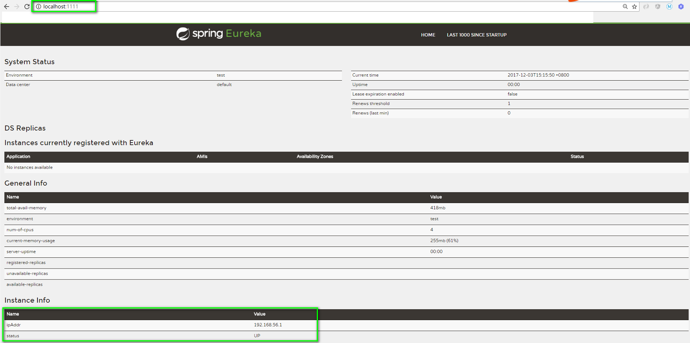

#### Spring Cloud Eureka Server 搭建

##### 一、环境准备
* IDEA 
* JDK 8
* MAVEN 

##### 二、创建Spring Boot项目，配置Eureka Server

* 使用Spring Initialize 工具新建项目


* 项目的基本信息配置


* 选择项目的基本依赖


* 选择Eureka Server的依赖（核心配置）


* 生成项目后，查看POM文件中的依赖配置

    
    ```xml
    <dependency>
        <groupId>org.springframework.cloud</groupId>
        <artifactId>spring-cloud-starter-eureka-server</artifactId>
    </dependency>
    ```
    
    ```xml
    <dependencyManagement>
        <dependencies>
            <dependency>
                <groupId>org.springframework.cloud</groupId>
                <artifactId>spring-cloud-dependencies</artifactId>
                <version>${spring-cloud.version}</version>
                <type>pom</type>
                <scope>import</scope>
            </dependency>
        </dependencies>
    </dependencyManagement>
    ```
    
##### 三、配置Eureka Server Project的基本信息

* 1.服务的端口
* 2.Eureka 的配置

具体配置如下：


```yml
# 项目的端口号配置
server:
  port: 1111

# Eureka Server的配置
eureka:
  instance:
    hostname: localhost
  client:
    # 由于该应用为注册中心，所以配置该应用不向注册中心注册自己
    register-with-eureka: false
    # 注册中心的职责就是维护服务实例，所以不需要去检索服务
    fetch-registry: false
    serviceUrl:
      defaultZone: http://${eureka.instance.hostname}:${server.port}/eureka

```

##### 四、配置完成之后，启动项目，查看一下我们的服务注册中心



##### 五、结束语
    到此，搭建Eureka Server (服务注册中心) 就结束了，下节就愉快的去注册一个服务提供者，Come On!